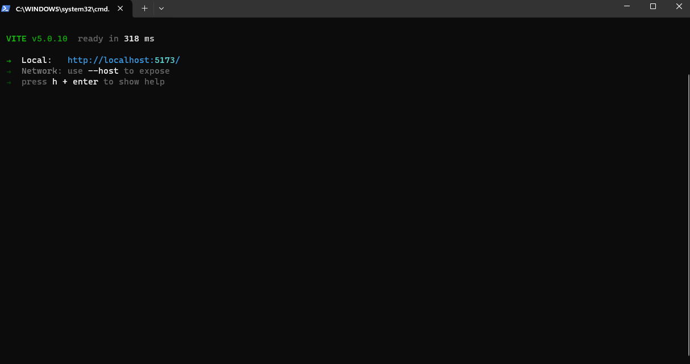

 ### Todo-App
This process is for those who want to start from scratch with setting up the Vite environment. I hope it is helpful for you.
### Installing Vite and npm environment.

To start building the project structure, you need to install  [Vite](https://vitejs.dev/guide/ "Vite"). Simply copy the command from the official Vite website.
```sh
npm create vite@latest
 ```

 If your're working with JS in the [Vite](https://vitejs.dev/guide/ "Vite") environment, after loading ,you'll be prompted to continue by
 pressing 'y'.Since everything is now in the [Vite](https://vitejs.dev/guide/ "Vite") environment,you need to install the [npm](https://www.npmjs.com/package/npm "Vite")


 ```sh
npm i npm
 ```

If everything is installed correctly, you should run the command
 ```sh
npm run dev
 ```
 It will take you to the port to load the Vite environment. Now that everything is installed, I will start with the project


 

 Copy the port and paste it into the browser; the Vite environment should appear.

 
 

